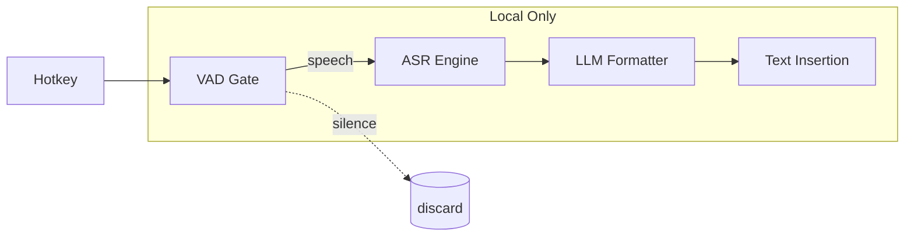

<div align="center">

# 🎤 **mjvoice**

**Privacy‑first, AI‑powered dictation for macOS with a liquid‑glass HUD**

<p align="center">
  <a href="https://developer.apple.com/macos/"></a>
  <a href="https://swift.org/"></a>
  
  </a>
</p>

<h3 align="center">
  <code>git clone &lt;YOUR_REPO_URL&gt; && cd mjvoice && open mjvoice.xcodeproj</code>
</h3>

</div>

---

## 🧭 Table of Contents

* [Highlights](#-highlights)
* [Demo](#-demo)
* [Why mjvoice?](#-why-mjvoice)
* [Performance Benchmarks](#-performance-benchmarks)
* [Core Features](#-core-features)
* [Installation](#-installation)
* [Usage Guide](#-usage-guide)
* [Architecture](#-architecture)
* [Development](#-development)
* [Performance Optimization](#-performance-optimization)
* [Troubleshooting](#-troubleshooting)
* [Privacy & Security](#-privacy--security)
* [Roadmap](#-roadmap)
* [License](#-license)
* [Acknowledgments](#-acknowledgments)

---

## 🌟 Highlights

* **Zero cloud** by default — offline ASR with CoreML or local Python runtime
* **Liquid‑glass HUD** overlay with waveform and status states
* **Push‑to‑talk** modes: press‑hold, latch, toggle
* **Smart formatting**: filler removal, punctuation, tone presets
* **System‑wide insertion** via Accessibility API (clipboard fallback)

> ℹ️ This README avoids dead links.
> Paths like `Docs/…` assume files exist in this repo. Replace `&lt;YOUR_REPO_URL&gt;` with your actual Git URL.

---

## 🎬 Demo

<details open>
<summary><strong>▶ Show demo media</strong></summary>

* **GIF/MP4 (recommended):** `Docs/images/demo.gif` or `Docs/videos/demo.mp4`
* **What to show:** hotkey → HUD appears → speak → formatted text inserted

```html
<!-- Fallback markup: shows image if GIF exists, otherwise nothing -->
<picture>
  <source srcset="Docs/videos/demo.mp4" type="video/mp4">
  
</picture>
```

</details>

> Example transformation block:
>
> ```
> BEFORE: "um hey can you uh send me that file like right now"
> AFTER:  "Hey, can you send me that file right now?"
> ⚡ Latency sample: 147 ms • 🔒 100% offline
> ```

---

## ⚡ Why mjvoice?

<div style="display:flex;gap:16px;flex-wrap:wrap">

<div style="flex:1;min-width:280px">

### 🚀 Instant Response

```text
Hotkey ──► Recording (VAD)
          ↓  ~80–120 ms
Transcribe ──► Format ──► Insert
          ↓  ~30–60 ms each stage
════════════════════════════════
Typical total: 110–180 ms
```

**Often faster than typing** for short phrases and quick replies.

</div>

<div style="flex:1;min-width:280px">

### 🔐 Privacy Fortress

```text
┌──────────────────────────────┐
│           YOUR MAC           │
│  Audio → VAD → ASR → Format  │
│           → Insert           │
│                              │
│  ❌ No cloud  ❌ Telemetry    │
└──────────────────────────────┘
```

**No data leaves your device** by default.

</div>

</div>

---

## 📊 Performance Benchmarks

<details open>
<summary><strong>Internal test snapshots on M‑series Mac</strong></summary>

> Numbers below mirror the project’s example benchmarks and are **for guidance**; your results will vary by hardware and model size.

| Engine                   | Cold Start | Warm Start | Proc. Cost (per audio min) | Memory | Est. Battery Impact | WER* | Verdict          |
| ------------------------ | ---------: | ---------: | -------------------------: | -----: | ------------------: | ---: | ---------------- |
| WhisperKit **tiny**      |     187 ms |      67 ms |                     347 ms |  28 MB |              −12 mW | 8.2% | ⚡ Mobile/battery |
| WhisperKit **small**     |     312 ms |      94 ms |                     687 ms |  89 MB |              −28 mW | 4.1% | 🎯 Balanced      |
| Fluid *(faster‑whisper)* |    1247 ms |     234 ms |                     912 ms | 312 MB |              −45 mW | 2.8% | 🏆 Max accuracy  |

*WER = Word Error Rate (lower is better)

</details>

---

## 🎯 Core Features

### 🎙️ Push‑to‑Talk Modes

| Mode           | Visual                  | Best For                                 |
| -------------- | ----------------------- | ---------------------------------------- |
| **Press‑Hold** | `⬇️ press … ⬆️ release` | Bursts (2–15 s): chats, searches         |
| **Latch**      | `tap ▶ recording ▶ tap` | Replies (15–60 s): emails, docs          |
| **Toggle**     | `on … off`              | Long dictation (≥1 min): notes, articles |

### 🤖 AI Text Transformation

<details>
<summary><strong>Click for examples</strong></summary>

```diff
INPUT:  "um so like I think we should uh maybe consider you know the alternatives"
- filler words removed
+ capitalization & punctuation
OUTPUT: "So I think we should maybe consider the alternatives."
```

```diff
INPUT:  "connect to postgres database using node j s"
+ technical capitalization
OUTPUT: "Connect to PostgreSQL database using Node.js."
```

</details>

### 🎨 Liquid‑Glass HUD States

```
IDLE  → LISTENING (waveform) → THINKING (spinner) → SUCCESS ✓ / ERROR ✗ / SECURE 🔒
```

### 📊 Engine Matrix

| Feature    | WhisperKit (tiny) | WhisperKit (small) | Fluid (faster‑whisper) |
| ---------- | :---------------: | :----------------: | :--------------------: |
| Accuracy   |       ⭐⭐⭐☆☆       |        ⭐⭐⭐⭐☆       |          ⭐⭐⭐⭐⭐         |
| Speed      |       ⭐⭐⭐⭐⭐       |        ⭐⭐⭐⭐☆       |          ⭐⭐⭐☆☆         |
| Battery    |       ⭐⭐⭐⭐⭐       |        ⭐⭐⭐⭐☆       |          ⭐⭐☆☆☆         |
| Memory     |       28 MB       |        89 MB       |         312 MB         |
| Cold Start |       187 ms      |       312 ms       |         1247 ms        |
| WER        |        8.2%       |        4.1%        |          2.8%          |
| Best Use   |       Mobile      |       Desktop      |       Plugged‑in       |

> 💡 **Adaptive Mode** can auto‑switch engines based on power/thermals.

---

## 📦 Installation

### ✅ Requirements

| Component | Minimum                                | Notes                  |
| --------- | -------------------------------------- | ---------------------- |
| macOS     | 13.0+ (Ventura/Sonoma/Sequoia)         |                        |
| CPU       | Apple Silicon (M1/M2/M3) or Intel AVX2 | M‑series recommended   |
| RAM       | 8 GB (16 GB recommended)               |                        |
| Storage   | 2 GB free                              | Models + runtime       |
| Xcode     | 15+ (CLT installed)                    | Build from source      |
| Python    | 3.8+                                   | Optional; Fluid engine |

### 🚀 Quick Start

<details open>
<summary><strong>Build from source</strong></summary>

```bash
# 1) Clone (replace with your repo URL)
git clone <YOUR_REPO_URL>
cd mjvoice

# 2) (Optional) Generate project from XcodeGen
xcodegen --spec project.yml

# 3) Open in Xcode
open mjvoice.xcodeproj

# 4) Configure Signing (Xcode → Signing & Capabilities)

# 5) Build & Run (⌘R)
```

See `Docs/BUILD.md` for details.

</details>

### 🔐 Permissions

* **Microphone** → auto‑prompted on first run
* **Accessibility** → System Settings ▸ Privacy & Security ▸ Accessibility ▸ add **mjvoice** (✅ checked)
* **Notifications (optional)** → for clipboard fallback alerts

### 📥 Model Installation

* **Automatic (recommended):** first use downloads CoreML Whisper models with checksum & resume.
* **Manual:** place `.mlmodelc` under `~/Library/Application Support/mjvoice/Models/`.
* **Fluid runtime:** Preferences ▸ Advanced ▸ *Install Fluid Runtime* (creates `~/.mjvoice/fluid/`).

---

## 🎓 Usage Guide

### ⌨️ Hotkeys

* Default: **Fn** (Globe) — supports press‑hold, latch, toggle
* Alternate: **⌘⌥Space** or any custom combo (Preferences ▸ General)

### Modes

<details>
<summary><strong>Streaming (real‑time)</strong></summary>

Low latency (<200 ms/word). May show partials briefly.

</details>

<details>
<summary><strong>Instant (buffered)</strong></summary>

Buffers a breath‑pause (~0.5–0.8 s) → cleaner punctuation.

</details>

<details>
<summary><strong>Notes Mode (scratchpad)</strong></summary>

Persistent window for brainstorming; export when ready.

</details>

### ✨ Smart Formatting

* **Tone presets:** neutral / professional / friendly
* **Per‑app presets:** Mail, Slack, VS Code, etc. via dashboard
* **Custom dictionary:** import CSV of technical terms

```yaml
Mail.app:
  tone: professional
  remove_fillers: true
  auto_capitalize: true
  punctuation: full
```

---

## 🏗️ Architecture

### High‑level flow (Mermaid)



### Components

* **Main App (SwiftUI):** menu bar UI, settings, orchestration
* **XPC services:** `AudioVADService`, `ASRService`, `LLMService` (sandboxed, auto‑unload)
* **Output layer:** Accessibility API → clipboard fallback → Notes window
* **Storage:** `~/Library/Application Support/mjvoice/` (preferences, snippets, usage, models)

---

## 🛠️ Development

### Project Structure

```text
mjvoice/
├─ mjvoice/ (SwiftUI app)
├─ Shared/ (models, utils, protocols, resources)
├─ Workers/ (XPC: AudioVAD, ASR, LLM)
├─ Tests/ (unit + integration)
├─ Docs/ (BUILD.md, PERFORMANCE.md, PRIVACY.md, USER_GUIDE.md, images/)
└─ tools/ (install scripts, model downloads, signing)
```

### XcodeGen

```bash
brew install xcodegen
xcodegen && open mjvoice.xcodeproj
```

### SwiftPM (example)

```swift
// Package.swift (conceptual)
.dependencies = [
  .package(url: "https://github.com/argmaxinc/WhisperKit.git", from: "0.5.0"),
  // VAD, utilities, etc.
]
```

---

## ⚡ Performance Optimization

* **Speed:** WhisperKit *tiny*, streaming mode, minimal formatting
* **Battery:** Adaptive mode on battery, tiny model, XPC auto‑unload (5 s)
* **Memory caps:** short audio buffers, lazy model load, limit transcript history

Target metrics snapshot (typical): idle RAM ≤30 MB app; hotkey response 67–92 ms; streaming latency 110–189 ms.

---

## 🧯 Troubleshooting (quick picks)

* **No text insertion?** Check Accessibility permission ▸ enable **mjvoice**; try clipboard fallback.
* **No audio?** Verify Microphone permission and input device in macOS Sound settings.
* **Fluid errors?** Re‑install runtime from Preferences ▸ Advanced; ensure Python ≥3.8.
* **Hotkey conflict?** Try **⌘⌥⌃D** or rebind Spotlight away from **⌘Space**.

See `Docs/USER_GUIDE.md#troubleshooting` for deep‑dive steps & logs.

---

## 🔐 Privacy & Security

* **Offline‑first:** ASR + formatting performed locally
* **Zero telemetry:** no analytics/crash reports sent
* **Sandboxed XPC:** least‑privilege services
* **Secure‑input aware:** pauses in password fields
* **Data at rest:** JSON in `~/Library/Application Support/mjvoice/` under your control

Data summary:

| Data          |  Stored  | Where        |      Network     |
| ------------- | :------: | ------------ | :--------------: |
| Audio buffers | RAM‑only | ephemeral    |         ❌        |
| Transcripts   |     ✅    | local JSON   |         ❌        |
| Preferences   |     ✅    | local JSON   |         ❌        |
| Models        |     ✅    | local folder | ⬇️ download only |

---

## 🗺️ Roadmap

* **v1.0:** PTT modes, WhisperKit/Fluid engines, HUD, snippets, per‑app presets, adaptive mode, XPC architecture
* **v1.1 (planned):** transcript window, multilingual support, auto‑language detect, better noise suppression
* **v1.2 (planned):** voice editing commands, macros, custom grammars

---

## 📄 License

**Status:** *TBD by project maintainers.* Until finalized, treat source as All Rights Reserved or per repository LICENSE once added.

> Recommendation: choose **MIT** (simple/permissive) or **Apache‑2.0** (patent grant). Add `LICENSE` before publishing binaries.

---

## 🙏 Acknowledgments

* **WhisperKit (Argmax)** — CoreML Whisper integration
* **Silero VAD** — voice activity detection
* **faster‑whisper (SYSTRAN)** — optimized Whisper inference
* **dtln‑rs** — real‑time noise suppression

---

<div align="center">

### 🌟 Built with ❤️ for the macOS community

If this project helps your workflow, consider starring the repo once it’s public.

</div>