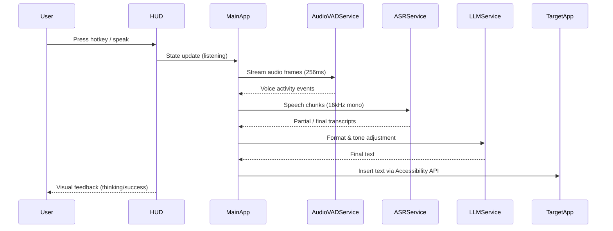

# 🎤 mjvoice

> **Privacy-first, AI-powered dictation for macOS with liquid-glass UI**

<p align="left">
  <a href="https://developer.apple.com/macos/">
    
  </a>
  <a href="https://swift.org/">
    
  </a>
  <a href="#license">
    
  </a>
  
</p>

- **🎯 Push-to-talk dictation that feels instant**
- **🔒 Offline-first speech recognition using WhisperKit and faster-whisper**
- **🎨 Liquid-glass HUD with adaptive feedback and per-app presets**
- **⚙️ Modular XPC architecture for resilience, privacy, and performance**

> ```bash
> # Quick start (build from source)
> git clone https://github.com/yourusername/mjvoice.git
> cd mjvoice
> open mjvoice.xcodeproj
> ```


---

<details>
<summary><strong>Table of Contents</strong></summary>

- [Features](#features)
- [Architecture](#architecture)
  - [XPC Services](#xpc-services)
  - [Audio Pipeline](#audio-pipeline)
  - [Model System](#model-system)
  - [Text Insertion Strategy](#text-insertion-strategy)
  - [Data Persistence](#data-persistence)
- [Installation](#installation)
  - [Requirements](#requirements)
  - [Pre-built Binary](#pre-built-binary)
  - [Build from Source](#build-from-source)
  - [Permissions Setup](#permissions-setup)
  - [Model Installation](#model-installation)
- [Usage](#usage)
  - [Hotkeys & PTT Modes](#hotkeys--ptt-modes)
  - [Dictation Modes](#dictation-modes)
  - [Model Selection](#model-selection)
  - [Formatting & Personalization](#formatting--personalization)
  - [Snippets & Dictionary](#snippets--dictionary)
- [Development](#development)
  - [Project Structure](#project-structure)
  - [Build System](#build-system)
  - [Dependencies](#dependencies)
  - [Extending the App](#extending-the-app)
  - [API Reference](#api-reference)
- [Performance](#performance)
- [Troubleshooting](#troubleshooting)
- [Privacy & Security](#privacy--security)
- [Advanced Usage](#advanced-usage)
- [Contributing](#contributing)
- [Roadmap](#roadmap)
- [License](#license)
- [Acknowledgments](#acknowledgments)
- [Support](#support)

</details>

---

## Features

- **Push-to-Talk Dictation**: Global hotkeys (Fn, `⌘⌥Space`) with press-hold, latch, and toggle modes for seamless control.
- **Offline ASR Engines**: WhisperKit (CoreML) and Fluid (faster-whisper) with dynamic model sizing (`tiny`, `base`, `small`) for speed or accuracy.
- **AI Text Formatting**: Removes filler words, applies smart punctuation, auto-capitalizes sentences, and respects tone presets (`neutral`, `professional`, `friendly`).
- **System-Wide Integration**: Works in any app via the macOS Accessibility API with clipboard fallback and secure-input detection safeguards.
- **Liquid Glass HUD**: Animated overlay visualizes audio levels and state transitions (`listening`, `thinking`, `idle`) with adaptive transparency.
- **Model Management**: Handles downloads/installations with progress indicators, mirror failover, and bundled noise suppression for instant setup.
- **Snippet Library**: Stores reusable templates with usage analytics and quick insertion workflows.
- **Usage Analytics**: Tracks word counts, WPM, weekly streaks, and session histories to help you stay productive.
- **Per-App Presets**: Customizes tone, formatting, and insertion behavior per application (e.g., formal email vs. casual chat).
- **Custom Dictionary**: Imports CSV vocabularies to bias recognition toward domain-specific phrases and acronyms.
- **Notes Mode**: Persistent scratchpad captures longer-form dictation sessions outside target apps.
- **Privacy-First Design**: Offline enforcement, sandboxed processes, hardened runtime, and a documented privacy manifest.
- **Battery & Thermal Awareness**: Switches ASR engines and model sizes based on power state and thermal load for optimal performance.

| Engine | Technology | Strengths | Best Use |
| --- | --- | --- | --- |
| WhisperKit | CoreML | Apple-optimized, low overhead | Offline, power-constrained laptops |
| Fluid | faster-whisper via Python runtime | Highest accuracy, GPU-ready | Long dictations, plugged-in workflows |

Dive deeper into user-facing capabilities in [`Docs/USER_GUIDE.md`](Docs/USER_GUIDE.md).

## Architecture



### XPC Services

- **Main Application**: Menu bar controller, dashboard UI, onboarding, and orchestration of services (`mjvoice/MainApp.swift`).
- **AudioVADService**: Silero CoreML VAD for real-time speech gating (`Workers/AudioVADService/`).
- **ASRService**: Hosts WhisperKit and Fluid engines with `SpeechRecognitionEngine` protocol implementations (`Workers/ASRService/ASRService.swift`).
- **LLMService**: Applies formatting, grammar adjustments, and tone transformations.
- **Service Lifecycle**: Independent sandboxes auto-unload after 5 seconds idle, preserving memory while ensuring responsiveness.

### Audio Pipeline

- **Capture**: `AudioEngine.swift` uses `AVAudioEngine` at native device sample rates.
- **Resampling**: `AVAudioConverter` downmixes to 16 kHz mono for ASR compatibility.
- **Chunking**: 4096-sample (≈256 ms) frames feed Silero VAD.
- **Gate Control**: VAD triggers begin/end of speech, reducing false positives.
- **Streaming**: ASR receives gated audio for low-latency partials while HUD shows RMS levels for user confidence.

### Model System

- **ModelManager**: Coordinates downloads, validations, and lifecycle (`Shared/Utilities/ModelManager.swift`).
- **Components**: Handles multi-file models (e.g., Fluid `config.json`, `model.bin`, `tokenizer.json`, `vocabulary.txt`).
- **Resilience**: Falls back to Hugging Face mirrors when primary downloads fail.
- **Bundled Assets**: Includes dtln-rs & RNNoise noise suppression for instant bootstrapping.

### Text Insertion Strategy

1. **Primary**: Accessibility attributes (`kAXSelectedTextAttribute`, `kAXValueAttribute`) for direct insertion.
2. **Fallback**: Virtual paste (`⌘V`) via clipboard while restoring previous contents.
3. **Clipboard Copy**: Notifies users when no editable field is available.
4. **Secure Input**: Pauses dictation to avoid password fields, surfaced through HUD warnings.

### Data Persistence

- **Preferences**: `~/Library/Application Support/mjvoice/preferences.json`.
- **Snippets**: `~/Library/Application Support/mjvoice/snippets.json`.
- **Usage Analytics**: `~/Library/Application Support/mjvoice/usage.json`.
- **Event Logs**: `~/Library/Application Support/mjvoice/events.json`.
- **Models**: `~/Library/Application Support/mjvoice/Models/`.

Refer to [`Docs/PRIVACY.md`](Docs/PRIVACY.md) for detailed data-handling policies and [`Docs/PERFORMANCE.md`](Docs/PERFORMANCE.md) for performance rationale.

## Installation

### Requirements

- **macOS**: Ventura (13.0) or newer.
- **Xcode**: 15+ with Command Line Tools.
- **Storage**: ≥2 GB free for ASR and noise models.
- **Python 3**: Required for Fluid runtime installation (automated via in-app installer).

### Pre-built Binary

- **Download**: Grab the latest `.dmg` from GitHub Releases.
- **Install**: Drag `mjvoice.app` to `/Applications`.
- **First Launch**: Gatekeeper prompts for verification; right-click → Open if needed.

### Build from Source

- **Clone**:
  ```bash
  git clone https://github.com/yourusername/mjvoice.git
  cd mjvoice
  ```
- **Generate Project** (optional if `mjvoice.xcodeproj` is up-to-date):
  ```bash
  xcodegen --spec project.yml
  ```
- **Open**: `open mjvoice.xcodeproj`.
- **Configure**: Set your Development Team in *Signing & Capabilities*.
- **Run**: `Cmd+R` to build and launch.

For extended build guidance, see [`Docs/BUILD.md`](Docs/BUILD.md).

### Permissions Setup

- **Microphone**: Automatically requested on first dictation attempt.
- **Accessibility**: System Settings → Privacy & Security → Accessibility → enable `mjvoice`.
- **Notifications**: Optional, used for clipboard fallback alerts.

### Model Installation

- **Automatic**: Models download on first use or via Preferences → *Speech Models*.
- **Manual**: Place model directories in `~/Library/Application Support/mjvoice/Models/` and restart the app.
- **Fluid Runtime**: Preferences → *Install Fluid Runtime* creates `~/.mjvoice/fluid/` with virtual environment and binaries.

## Usage

### Hotkeys & PTT Modes

- **Default Hotkey**: `Fn` (globe key) or `⌘⌥Space`.
- **Modes**:
  - **Press-and-Hold**: Record while keys are depressed.
  - **Latch**: Tap once to start, tap again to stop.
  - **Toggle**: Switch recording on/off with a single press.
- **Customization**: Preferences → *General* → *Change Hotkey* (supports `Fn`, `⌘`, `⌥`, `⌃`, `⇧`).

### Dictation Modes

- **Streaming**: Inserts transcript live as words arrive.
- **Instant**: Buffers sentences, inserts on punctuation or extended pauses.
- **Notes**: Routes output to the persistent scratchpad window for later review.

### Model Selection

- **WhisperKit**: Lightweight CoreML models (`tiny` → fast, `small` → accurate).
- **Fluid**: Python-powered faster-whisper for high accuracy and GPU acceleration.
- **Adaptive Selection**: Battery or thermal events auto-switch to Tiny/Turbo modes.

### Formatting & Personalization

- **Auto-Capitalization**: Ensures sentence starts are uppercase.
- **Filler Removal**: Filters "um", "uh", "like", etc.
- **Tone Presets**: Neutral, Professional, Friendly; configurable per app.
- **Per-App Presets**: Dashboard → *Personalization* to tailor formatting per application.

### Snippets & Dictionary

- **Snippets**: Dashboard → *Snippets* → *New Snippet*, insert via menu bar or global search.
- **Custom Dictionary**: Dashboard → *Dictionary* → Import CSV or add manual entries.
- **Tracking**: Usage metrics quantify snippet performance and vocabulary hits.

Explore advanced workflows in [`Docs/USER_GUIDE.md`](Docs/USER_GUIDE.md).

## Development

### Project Structure

- **`mjvoice/`**: Main app sources (SwiftUI views, audio, accessibility, hotkeys).
- **`Shared/`**: Models, utilities, assets, XPC protocols used across targets.
- **`Workers/`**: XPC service targets (ASR, Audio/VAD, LLM formatters).
- **`Tests/`**: Unit and integration tests.
- **`Docs/`**: Supplemental documentation (`BUILD`, `PERFORMANCE`, `PRIVACY`, `USER_GUIDE`).
- **`tools/`**: Scripts such as `install_fluid_runner.sh`.

### Build System

- **XcodeGen**: `project.yml` defines targets; run `xcodegen` to regenerate the workspace.
- **Swift Package Manager**: Manages third-party dependencies (WhisperKit, etc.).

### Dependencies

- **WhisperKit**: CoreML transcription models optimized for Apple silicon.
- **Silero VAD**: CoreML-based voice activity detection.
- **Fluid Runtime**: Python-based faster-whisper for high-accuracy transcription.
- **dtln-rs**: TensorFlow Lite noise suppression.

### Extending the App

- **ASR Engine**: Implement `SpeechRecognitionEngine` in `Workers/ASRService/` and register with `ASRService.swift`.
- **Formatter Rules**: Extend `TextFormatter` in `Shared/Utilities/TextFormatter.swift`.
- **UI Panels**: Create SwiftUI components and integrate via `DashboardView.swift`.
- **New Services**: Define protocols in `Shared/XPCProtocols/`, add targets via `project.yml`.

### API Reference

```swift
AudioEngine.shared.startPTT()
AudioEngine.shared.stopPTT()
ASRClient.shared.startStream()
ASRClient.shared.sendChunk(_ data: Data)
ASRClient.shared.endStream()
TextInserter.shared.insert(text: "Hello world")
ModelManager.shared.download(modelID: "whisper-small")
ModelManager.shared.installedModels()
PreferencesStore.shared.update { prefs in /* mutate */ }
SnippetStore.shared.add(snippet)
SnippetStore.shared.remove(id: snippetID)
UsageStore.shared.logTranscription(metrics)
```

See [`Docs/BUILD.md`](Docs/BUILD.md) and code comments within `mjvoice/` for deeper implementation details.

## Performance

- **Targets**:
  - **Idle RAM**: ≤30 MB (main app).
  - **Service Lifetime**: XPC services exit after 5 seconds idle.
  - **Hotkey-to-Record**: <100 ms response.
  - **Streaming Latency**: <150 ms (model-dependent).
  - **Cold Start**: ≤250 ms with cached models.
- **Optimization Tips**:
  - **Model Choice**: Use `tiny` for speed, `small` for accuracy.
  - **Offline Mode**: Bypass network checks for faster starts.
  - **Disable Formatting**: Skip LLM pass when speed is critical.
  - **Fluid on Battery**: Prefer WhisperKit when unplugged to save power.
- **Profiling**: Use Instruments (Time Profiler, Allocations, Energy) to validate targets.
- **Memory Management**: Lazy-load models and leverage auto-unload from XPC services.

Detailed benchmarks live in [`Docs/PERFORMANCE.md`](Docs/PERFORMANCE.md).

## Troubleshooting

- **Text Fails to Insert**: Confirm Accessibility permission and ensure the target field is editable.
- **No Audio Captured**: Re-enable Microphone permission and verify system input device selection.
- **Model Download Fails**: Check internet connectivity or perform manual download into the models directory.
- **Fluid Runtime Errors**: Ensure Python 3 is installed; reinstall runtime from Preferences.
- **Hotkey Conflicts**: Check for collisions with other apps and assign a unique combination.
- **Secure Input Stuck**: Close password fields or restart the app to clear secure input.
- **High CPU Usage**: Inspect Launch Services for orphaned XPC processes; relaunch the app.
- **Diagnostics**: Use Console.app filters (`mjvoice`, `ASRService`) for detailed logs.

## Privacy & Security

- **Data Collection**: No cloud telemetry by default; all processing remains local.
- **Offline Mode**: Enforces local processing and blocks network activity.
- **Audio Handling**: Buffers remain in RAM; no disk persistence.
- **Transcription Storage**: Usage data stored locally at `~/Library/Application Support/mjvoice/usage.json` and fully user-controllable.
- **Sandboxing**: App and services employ hardened runtime with least-privilege entitlements.
- **Privacy Manifest**: Located at `Shared/Resources/PrivacyInfo.xcprivacy`.
- **Secure Input Awareness**: Detects password fields and gracefully pauses dictation.
- **Model Sources**: Downloads originate from trusted mirrors or bundled archives.

Reference [`Docs/PRIVACY.md`](Docs/PRIVACY.md) for compliance details.

## Advanced Usage

- **Custom CoreML Models**: Drop `.mlmodelc` bundles into the models directory and select via Preferences.
- **Fluid Overrides**: Set `MJVOICE_FLUID_RUNTIME` environment variable to point at custom runners.
- **Per-App Grammar Prompts**: Dashboard → *Personalization* → configure grammar or tone per application bundle ID.
- **Snippet Shortcuts**: Assign macOS keyboard shortcuts via System Settings → Keyboard → Shortcuts → *App Shortcuts*.
- **Vocabulary Import**: Prepare CSV with one term per line; import via Dictionary → *Import CSV*.
- **Custom Hotkeys**: Combine modifiers (`⌘`, `⌥`, `⌃`, `⇧`) with letters, function keys, or `Fn`.
- **Notes Window Persistence**: Access scratchpad content via menu bar → *Open Notes*.

## Contributing

- **Bug Reports**: Open a GitHub issue with reproduction steps, logs, and system information.
- **Feature Requests**: Describe use cases and include mockups or workflows where possible.
- **Pull Requests**: Fork the repo, branch from `main`, add tests, and document user-facing changes.
- **Code Style**: Follow Swift API Design Guidelines; run SwiftLint if configured.
- **Testing**: Add unit coverage under `Tests/UnitTests/` and integration coverage where applicable.
- **Documentation**: Update this README and relevant files in `Docs/` when behavior changes.

## Roadmap

- [ ] Cloud ASR option (Deepgram, AssemblyAI) with ZDR endpoints.
- [ ] Real-time streaming transcription display.
- [ ] Multi-language support with auto-detection.
- [ ] Voice command grammar ("new paragraph", "delete that", "undo").
- [ ] Integrations with Obsidian, Notion, and Bear.
- [ ] iOS companion app for remote dictation.
- [ ] Custom wake word for hands-free activation.
- [ ] Speaker diarization for multi-speaker sessions.

## License

- **Status**: License TBD — update this section when the final license (e.g., MIT, Apache 2.0, GPL) is chosen.
- **Copyright**: © {YEAR} mjvoice contributors.

## Acknowledgments

- **WhisperKit** by Argmax.
- **Silero VAD** by the Silero team.
- **faster-whisper** by SYSTRAN.
- **dtln-rs** maintainers for noise suppression advances.
- **Community Contributors** for testing, feedback, and feature ideas.

## Support

- **Email**: [support@mjvoice.app](mailto:support@mjvoice.app)
- **Documentation**: https://docs.mjvoice.app
- **Discord**: https://discord.gg/mjvoice
- **GitHub Issues**: https://github.com/yourusername/mjvoice/issues
